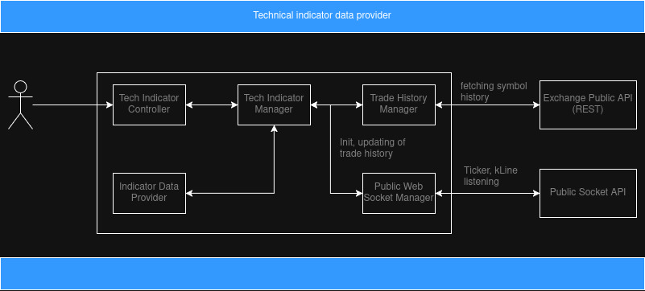

# crypto-analysis-tech-provider

[](https://github.com/Spayker/crypto-analysis-tech-provider/actions/workflows/ci.yml) &nbsp;
[](https://github.com/Spayker/crypto-analysis-tech-provider/blob/main/LICENSE)

## Overview
Originally, [TradingView](https://www.tradingview.com/) API does not provide any possibilities to get favourite indications (f.e. rsi, macd or bollinger bands). It gives only well shaped UI snippet that can be integrated with frontend and that's it.

This MVP tries to solve the problem, by giving a free REST API, which can provide latest indicator data by requested:
- time frame
- symbol
- indicator name 

Works only with ByBit crypto exchange (for now). Currently supported indications:
- rsi
- macd
- bollinger bands

Supported time frames:
- minute
- hour
- day

Service limitations:
- max indicator limitation: 10 (configurable)
- max indicator range: 240 for minutes and hours, 120 for days (configurable)

From the beginning the user with ADMIN role must use POST end point to add indicators. Then users can get list of supported indications per symbol, time frame and request data. More details are described below. 

## REST API end points
Below is a table of REST endpoints defined in `TechIndicatorController`.

| Method | Endpoint | Parameters | Description | Authorization |
|--------|----------|-------------|-------------|----------------|
| GET | `/v1/tech/indicators` | — | Fetch all available technical indicators | Not required |
| GET | `/v1/{symbol}/tech/indicators/{indicatorName}` | `symbol` — [a-zA-Z]{1,10}<br>`indicatorName` — string<br>`timeFrame` — query param | Retrieve indicator data for a specific symbol | Not required |
| POST | `/v1/{symbol}/tech/indicators/{indicatorName}` | `symbol` — [a-zA-Z]{1,10}<br>`indicatorName` — string<br>`timeFrame` — query param | Add a new technical indicator for a symbol (accessible via admin panel) | Requires `ADMIN` role |--------|----------|-------------|--------------|----------------|

### Example Request
```
GET /v1/btc/tech/indicators/rsi?timeFrame=hour
```

---

## How It Works
1. The client sends a GET request.
2. The controller constructs an `IndicatorRequest`.
3. `TechIndicatorManager` processes the request:
    - validates parameters;
    - fetches kline data from exchange;
    - calculates the requested indicator;
    - runs socket subscription to requested channel in order to keep indicator data updated
    - returns the result to the controller.
4. The controller responds back to the client.

---

## Architecture


Main components:
- Tech Indicator Controller: handles user requests, performs request validation, forwards requests to service layer
- Indicator Data Provider: stores indicator data and updates it, according to web socket ticker, kline subscriptions
- Tech Indicator Manager: processes users requests after additional business related validations
- Trade History Manager: stores and updates trade history by time frame and symbols
- Public Web Socket Manager: establishes socket channels with Bybit exchange to listen latest kline and ticker events

---

## Technical Stack
1. Java 21
2. Spring Boot 3
3. Feign Client
4. WebSockets
5. Jackson
6. Gson
7. JUnit 5
8. GitHub Actions

## How To Run
Run the application with Bybit profile:
```
-Dspring.profiles.active=bybit
```

## Further vectors of improvements
Most exciting vectors of improvements are presented below:
- different exchanges support (Binance, CoinBase, Kraken etc...)
- different indicators support (ADX, EMA, ATR etc...)
- extended admin tools (removing of already added indications)
- security part (enabling https, adding jwt)
- indicator data persistence for accumulating of bigger data volumes per exchange, symbol, indicator, time frame
- socket subscription to provide latest changes of indications
- further improvements of data accuracy generation

## License
GNU 3